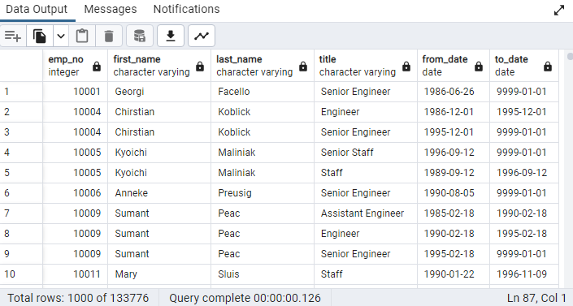
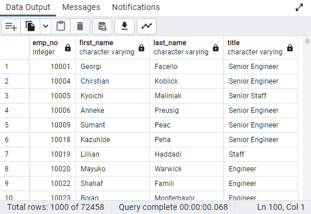
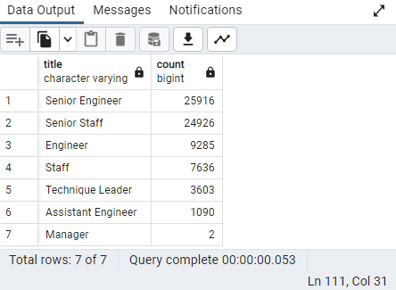
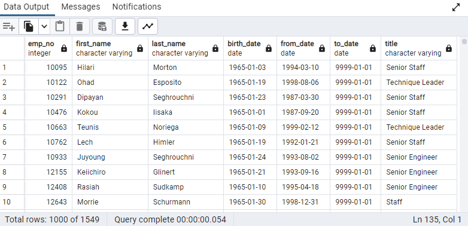
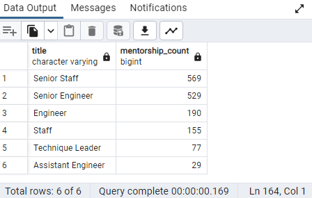

# Pewlett-Hackard-Analysis

## Overview of the Analysis 

The purpose of this analysis is to help Pewlett Hackard (PH) prepare for the upcoming "Silver Tsunami" - a large number of employees reaching retirement age. This analysis aims to understand the number of roles that will potentially be vacated, and how many employees are eligible to be mentors for the next generation of PH employees.

## Results 

The four major points from the analysis are:

- On the first review of the "Silver Tsunami" we have a result of 133,776 employees, across various titles, are reaching retirement age. This query contained many duplicates due to employees holding multiple positions over their employment.

- After removing duplicates and keeping the most recent title per employee, there are still 72,458 unique titles that are potentially going to be vacant.

- The most significant impacts will be in 'Senior Engineer' and 'Senior Staff' roles, with 25,916 and 24,926 roles to be vacated respectively.

- There are 1,549 employees who are eligible to participate in a mentorship program to train the next generation of employees.

## Summary

**How many roles will need to be filled as the "silver tsunami" begins to make an impact?**
According to the analysis, a total of 72,458 roles will potentially need to be filled as the "Silver Tsunami" begins to make an impact.

**Are there enough qualified, retirement-ready employees in the departments to mentor the next generation of Pewlett Hackard employees?**
There are 1,549 potential mentors identified as part of the analysis. Whether this is enough depends on the expected ratio of mentors to mentees and how many new hires are expected to be onboarded.

### Additional Insights

1. **Potential Retirees by Department**:
   Running a query to analyze the distribution of potential retirees across the various departments can help each department plan better. This will show which departments are expected to have the most significant staff reduction due to retirement.
   
   

2. **Potential Mentors by Title**: 
   Understanding the distribution of potential mentors across various titles can help assess the potential knowledge gaps and plan the recruitment strategy accordingly.
   
   
